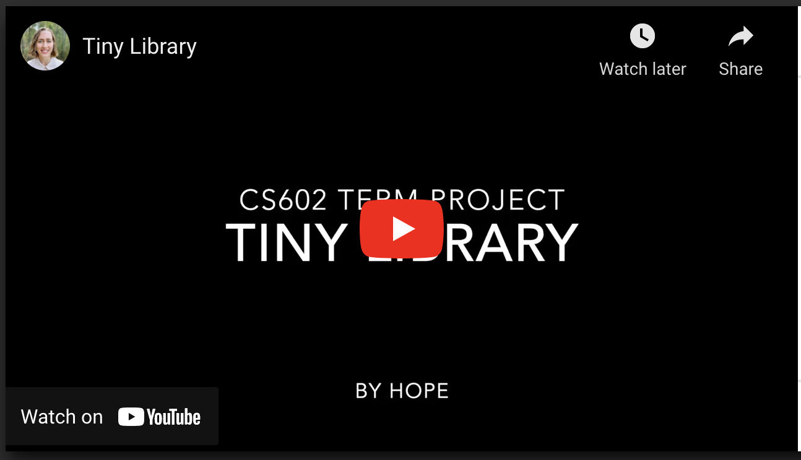

# Tiny Library

## Tech Stack
* Node.js
* JavaScript
* Express with Passport authentication
* MongoDB with Mongoose ODM and aggregation pipelines
* Handlebars
* REST APIs for JSON and XML

## Summary
Tiny Library is a library loan management system with different access levels for patrons, librarians, and unauthenticated users.

## Video Demo

## Database Models
The app implements the following models/ MongoDB collections:
* **User:** can be type Admin or Patron. Authentication and password hashing is handled by Passport middleware.
* **Book:** stores information about a book's title, author, subject, summary, and the number of copies in inventory.
* **Hold:** keeps track of a user's pending request to check out a book. (A user must place a Hold on a book in order to check it out.)
* **Loan:** stores data about a copy of a book that is checked out to a user, including a time of checkout and a time of return, if applicable.
* **Favorite:** stores an association of a user's favorite books.

The MongoDB connection is stored in db/dbconnect.js and the dbinit.js file can be run to seed the library with book data.

## Unauthenticated Views
* Homepage: the landing page shows a list of all books in the library, including title, author, year published, and subject. Each book has a link to view the individual book page.
* Search: the navbar contains a search field to search the library's catalog by title, author, or subject. The search feature uses regex to match all possible fields.
* Individual book page: an individual book's page contains more detailed information about the book, such as its summary. Users who are not logged in do not have access to the "Request Hold" and "Add to Favorites" features (see below).
* Log In/ Register: these pages allow users to CREATE a user profile and log in, including error checking with custom flash messages for unavailable username, non-matching password confirmation field, or invalid credentials.

## Patron (library user) Views
* Individual book page: an authenticated user sees "Add to Favorites" and "Place Hold" buttons on an individual book's page, or "Remove from Favorites" and "Remove Hold" if the user already has these books on either list. The "Place Hold" button is disabled if the user currently has the book checked out. These buttons send a POST request with fetch from the client to the server-side API endpoint, which updates the database with CREATE or DELETE. When a success message is returned, the DOM is updated so the buttons reflect the book's addition to/ removal from the user's Hold or Favorite lists.
* Loans & Holds: shows two lists--a list of books currently checked out, with the date of checkout, and a list of books the user has placed on hold, with the date of hold placed. Books on the "hold" list get transferred to the "loans" list when a librarian approves the checkout (see below).
* History: shows a list of all books a user has checked out in the past, e.g. all loans that have both a borrowed and return date.
* Favorites: shows a list of all books the user has added to their "Favorites" list.
* Logout: this route, which is available in the navbar to any authenticated user, unauthenticates the session and redirects to homepage.

## Librarian (admin) Views
* Manage Loans: a page for a librarian to check out and check in books. To check out a book to a user, that user must have requested the book by placing a hold on it. 
  - For Pending Holds section, the route for this view aggregates the User, Book, Loan, and Hold models to display the book title, book author, datetime the hold was placed, how many copies of the book exist in inventory, and how many copies are currently loaned out. If the loaned copies is equal to the total copies, the "Checkout" button is automatically disabled. Error-checking is additionally done when a librarian approves a loan to ensure that enough copies are available. If so, the new Loan is CREATED with auto-datetime and the Hold is DELETED.
  - For Current Loans section, the librarian selects "Checkin" button to return the copy of the book to the system. This UPDATES the loan record with a "returned" property of the current datetime. The user can now view this book in their "History" page.
* Add Books: displays a form for the librarian to CREATE a new book with all necessary data: title, author, copies, subject (a dropdown limited to the enum fields), publishing year, number of copies, and summary. Server-side validation checks that a book with that title and author doesn't already exist-- if it does, book creation is prevented and a flash error message displays above the book form.
* Update Inventory: displays a list of all books with "Edit" and "Delete" buttons. 
  - When "Edit" is clicked, the DOM is updated to show a field to enter an updated number of copies and "Edit" button transforms into "Submit". When a new number of copies is submitted, a fetch POST request is sent to REST API endpoint with the book ID and the new number of copies. The server validates that the new copy number isn't less than the number of that book already checked out (e.g. loans) and rejects the request if so. If the new number passes validation, the Book document is UPDATED with the new copies, the new number is returned in JSON, and the DOM is updated to display the new table row.
  - When "Delete" is clicked, first a modal pops up to confirm deletion of the book. When confirmed, the front-end JS sends a fetch request to REST endpoint to DELETE the book. The back-end first error-checks to ensure no copies of the book are currently loaned out, then deletes the book, as well as all Favorites and Loans associated with the book. If the client receives a success message in the JSON response, the DOM is updated to remove that book's table row from view.

### Flash Messages, Authentication, and Error Handling
* Flash Middleware: as demonstrated in Ethan Brown's book "Web Development with Node and Express", I've defined a custom-flash middleware which works with the Express-Flash package to take flash messages set on the request object and make them automatically available on the response, along with color-coding properties for Bootstrap alerts. This way, the flash message is automatically available in the view upon redirect without having to pass it each time in the context.
* In addition to the Passport and Connect-Ensure-Login npm packages, I've defined a custom-user middleware which makes user data automatically available in the Handlebars templates, and custom-admin middleware which checks if the user is an Admin (librarian) and prevents access to restrict pages if not.
* Error View: there is also an "Error View" page which is added as the last middleware and renders an error page with friendly message/ error status for any database errors or resources not found. Most specific user errors are handled with the flash messages above, but this is a fallback for any 404s or other unforeseen errors.

### Postman/ Curl REST APIs
Unlike the APIs explained above which send data to the views with front-end JavaScript, the following endpoints are not linked to the views in this project but can provide Book data via Curl or Postman. The header 'application/xml' or 'application/json' must be set, and all endpoints can return XML or JSON depending on header.
* Get all books: provides the URL '/api/getbooks' to return a list of all books with all their data.
* Get books by title: provides the URL '/api/getbooks/title/:title' to return a list of all books that contain the phrase specified in the param in their title. It uses regex so subsections or phrases will match in addition to full titles.
* Get books by author: provides the URL '/api/getbooks/author/:author' to return a list of all books by a specific author. The space in author's name must be encoded with %20 e.g. Johnathan%20Franzen.

### Conclusion
This project was a fun opportunity to learn about CRUD with Mongo, aggregation, sessions, authentication, APIs, async/await, and Express middleware with Node.
